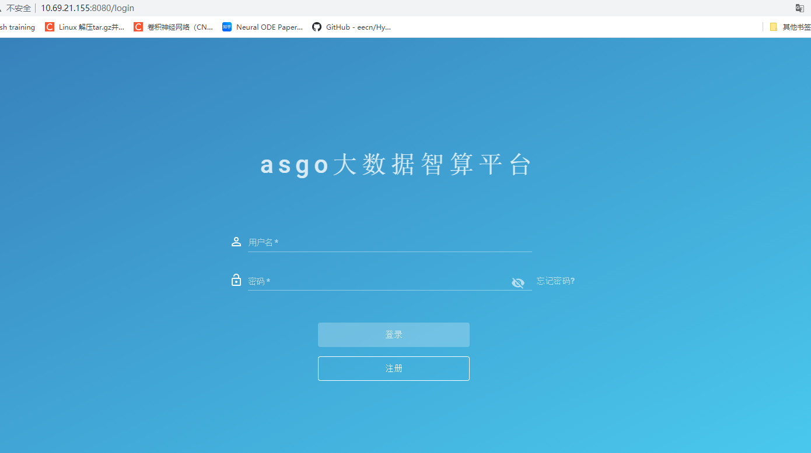

# 欢迎来到asgo大数据智算平台

集群支持SLURM任务调度、容器、虚拟机等不同应用场景。

对于刚刚开始学习使用集群的用户，推荐先了解
[Linux基本操作](http://10.68.219.148:8080/help/app/linux.html)、[Conda入门指南](http://10.68.219.148:8080/help/app/conda.html)和[SLURM基本指令](https://slurm.schedmd.com/quickstart.html)。


### 用户注册、登录
打开浏览器，输入：
>  http://10.68.219.148:8080



### 使用模式
计算云主要支持三种模式：

1)对于计算资源使用量较大、有一定Linux命令行基础的用户，可以考虑使用公共集群或者独占集群模式。这两种模式都使用作业调度系统提交作业。不同在于公共集群按作业运行时长来计费，独占集群的计费从分配资源开始到资源释放，如果中间并未运行作业，依然计费。

2)如果对Linux命令行不熟悉，我们提供了私有/共享实例模式，可以在“申请资源”处申请有交互界面的计算资源，提供了Jupyter等有交互界面的工具，上手简单，无需学习Linux，适用于无计算机背景的新用户。此模式优点是学习成本低，缺点是计费方式粒度粗，不适合有大量计算任务的用户。用户也可以前期使用这类交互界面实例，如发现计算量较大，建议逐渐迁移到公共集群模式上，该模式计费更准确。

3)对于想独占计算资源的用户，可以使用独占集群模式

### 集群登录
- 通过Firefox或者Chrome浏览器访问 http://10.68.219.148:8080 并登录，选择“共享资源”，可以看到平台提供的公共集群；
- 对于共享集群和独占集群，以及自带SSH服务的实例可以通过SSH直接登录。如果实例没有自带SSH服务，可以通过自行配置；

> Windows推荐使用PuTTY，SecureCRT，Xmanager等客户端访问集群的服务端口，Linux/Mac直接使用终端即可。

> ssh -p 20011 username@10.68.219.148

### 文件传输
- 每位用户会分配一个个人目录用于私有实例，路径为 /home/USERNAME 。

- 每个用户分配一个共享文件系统上的目录，作为独占集群里的Home目录，路径为 /group_homes/PRIVATE_CLUSTER/home/USERNAME 。

- 对于加入公共集群的用户，系统会为用户在公共集群中分配一个Home目录，路径为 /group_homes/PUBLIC_CLUSTER/home/USERNAME。

### 作业系统
在公共集群中使用SLURM作业调度系统进行任务的调度和管理。
日常使用超算资源只需掌握简单的几条命令即可，具体详细的配置请参考 https://slurm.schedmd.com/documentation.html


### Slurm作业提交：
1) 系统界面提交 http://10.68.219.148:8080/help/manual/job.html#id7
系统支持直接在页面提交作业。
点击上方“集群”按钮，选择“提交作业”。
选择需要使用的集群和作业模板，填写作业名称，在脚本编辑器里填入作业脚本，点击右上方的“提交作业”按钮。
提交作业后，可以在“作业”页面查看是否提交成功。
2) 终端提交
提交GPU集群作业请先编写作业脚本，并通过`sbatch`命令提交。

假设作业脚本文件名为job.sh，
```
### 表示这是一个bash脚本
#!/bin/bash
### 设置该作业的作业名
#SBATCH --job-name=JOBNAME
### 指定该作业需要2个节点数
#SBATCH --nodes=2
### 每个节点所运行的进程数为40
#SBATCH --ntasks-per-node=40
### 作业最大的运行时间，超过时间后作业资源会被SLURM回收
#SBATCH --time=2:00:00
### 申请1块GPU卡
#SBATCH --gres=gpu:1
### 指定从哪个项目扣费。如果没有这条参数，则从个人账户扣费
#SBATCH --comment project_name
### 程序的执行命令
mpirun hostname

```

则通过以下命令提交：

`sbatch job.sh`

等作业执行完成后，默认会把程序的输出放到slurm-作业编号.out的文件中，可通过该文件查看程序的输出。

### 项目共享 http://10.68.219.148:8080/help/manual/project.html#id3
共享项目中可以包含多位用户、多个实例。项目内其他成员可以查看共享到项目内的实例，也可以选择将实例计费计入项目中。

### 环境配置
超算平台上预先安装了常用的科学计算类的软件，默认安装路径为/opt/app/，用户可直接使用预编译好的可执行文件进行计算。

比如使用预装的conda，在安装无需向anaconda目录写入内容的包时，可以通过配置环境变量使用，即在.bahsrc中添加路径即可：

> vim .bashrc

编辑路径，在脚本末尾添加：

'export PATH=/opt/app/anaconda3/bin:$PATH'

如果在使用conda时，遇到没有权限写入等错误，则需要在自己路径下安装Miniconda。

Miniconda在路径：/opt/app/anaconda3/Miniconda3-latest-Linux-x86_64.sh

将该安装包复制到自己路径下，然后输入如下命令进行安装，安装完成后即可使用。

./ Miniconda3-latest-Linux-x86_64.sh

### 其他环境配置
如果系统预装环境不能够满足计算需求，则需要大家自己进行相关开发环境配置。

### 参考材料
1. [Linux基本操作](http://10.68.219.148:8080/help/app/linux.html)
2. [Conda入门指南](http://10.68.219.148:8080/help/app/conda.html)
3. [Slurm官方手册](https://slurm.schedmd.com/quickstart.html)
